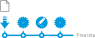

In this tutorial, the network is quite simple and made of two lines in parallel, with on the left side a generator and on the right side a load. The load consumes 600 MW and the generator produces 606.5 MW. A load flow computes the flows through the two lines. The flow through the upper line is of 302.4 MW at its entrance and of 300.4 MW at its exit. The flow through the lower line is the same. The power losses are of 2 MW on each line.   

{: width="50%" .center-image}


We apply a contingency: the upper line is disconnected. A new load flow computes the flow on the lower line: it is now of 610.6 MW at its entrance and of 601 MW at its exit. The rest of the difference between load and generation represents the losses during the voltage transformation process.

{: width="50%" .center-image}

# Workflow

The tutorial can be expressed in a short and easy workflow. All the input data are stored in a XIIDM file. This file is imported with the IIDM gateway. Then, a load flow simulator is launched to get flows on all nodes. In this tutorial, the simulator is Hades2 but could be an other load flow simulator, as the API interface contract is respected. A contingency is created and finally, the flows are computed again in order to get the final state.  

{: width="75%" .center-image}

# Identification of the power system blocks


The network is modeled in [IIDM](../iidm/model/index.md), which is the internal model of PowSyBl. This model can be serialized in a XML format for experimental purposes.
```java
File file = new File(/path/to/file/eurostag-tutorial1-lf.xml");
```
<br />

The file is imported through a gateway that converts the file in a in-memory model.
```java
Network network = Importers.loadNetwork(file.toString());
```
<br />

Then, flows are computed with a load flow simulator. In this tutorial, we use Hades2, which is a non open source software, but available in a freeware mode for experimental purposes. For more details, please visit this [page](https://rte-france.github.io/hades2/features/loadflow.html) to learn about Hades2. A `LoadFlow` object is created through a factory, here a `Hades2Factory`, which needs as input arguments a on-memory network and a computation manager `computationManager` (here defined locally by default).

```java
ComputationManager computationManager = LocalComputationManager.getDefault();
LoadFlow loadflow = new Hades2Factory().create(network, computationManager, 0);
```

A loadflow is run on a variant of the network with a set of parameters. The default parameters are listed [here](../configuration/parameters/LoadFlowParameters.md). Here angles are set to zero and voltages are set to one per unit. The computed flows are stored in the variant given in input. Note that a network variant is close to a state vector and gathers variables such as injections, productions, tap positions, states of buses, etc.

```java
LoadFlowParameters loadflowParameters = new LoadFlowParameters().setVoltageInitMode(LoadFlowParameters.VoltageInitMode.UNIFORM_VALUES);
network.getVariantManager().cloneVariant(VariantManagerConstants.INITIAL_VARIANT_ID, "loadflowVariant");
LoadFlowResult result = loadflow.run("loadflowVariant", loadflowParameters).join();
```
<br />

A contingency is simply simulated in disconnecting both terminals of the `NHV1_NHV2_1` line.

```java
network.getLine("NHV1_NHV2_1").getTerminal1().disconnect();
network.getLine("NHV1_NHV2_1").getTerminal2().disconnect();
```
<br />

Once the continency is applied on the network, the post-contingency state of the network is computed through a loadflow the way we see above.

# Going further
The whole tutorial is available in [powsybl-tutorials](https://github.com/powsybl/powsybl-tutorials/tree/master/loadflow).
