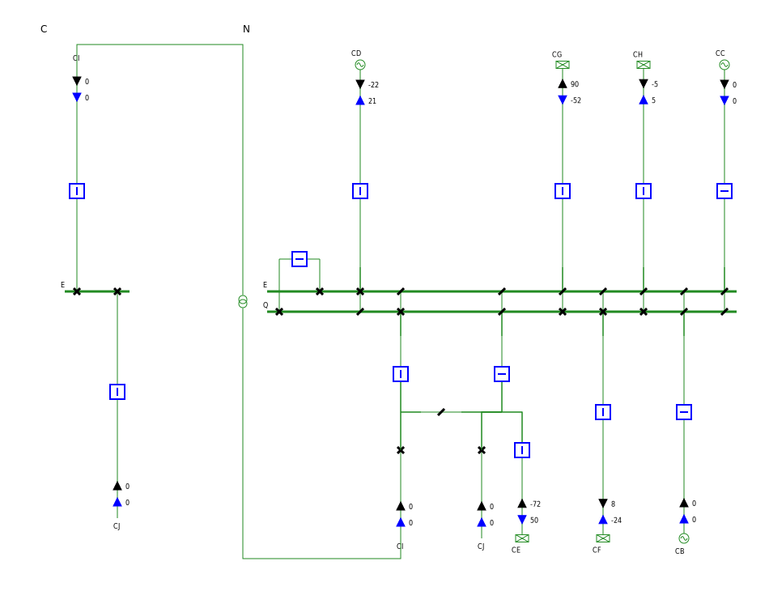

# Single Line Diagram - SVG Writing

The `com.powsybl.sld.svg.DefaultSVGWriter` class of [powsybl-single-line-diagram](../repositories/powsybl-single-line-diagram.md) is an implementation of the `SVGWriter` interface which allows to generate SVG files representing single line diagrams of a substation, a voltage level or a zone. 
We are showing in this guide how to create some single line diagrams first from a test network, then from a [CGMES](../../grid/formats/cim-cgmes.md) file.

## Prerequisites

### Maven dependencies
First of all, we need to add some Maven dependencies in our `pom.xml` file:

```xml
<dependencies>
    <dependency>
        <groupId>com.powsybl</groupId>
        <artifactId>powsybl-single-line-diagram-core</artifactId>
        <version>${powsybl.sld.version}</version>
    </dependency>
    <dependency>
        <groupId>com.powsybl</groupId>
        <artifactId>powsybl-iidm-impl</artifactId>
        <version>${powsybl.core.version}</version>
    </dependency>
    <dependency>
        <groupId>com.powsybl</groupId>
        <artifactId>powsybl-iidm-test</artifactId>
        <version>${powsybl.core.version}</version>
    </dependency>
    <dependency>
        <groupId>com.powsybl</groupId>
        <artifactId>powsybl-config-test</artifactId>
        <version>${powsybl.core.version}</version>
    </dependency>
    <dependency>
        <groupId>com.powsybl</groupId>
        <artifactId>powsybl-cgmes-conversion</artifactId>
        <version>${powsybl.core.version}</version>
    </dependency>
    <dependency>
        <groupId>com.powsybl</groupId>
        <artifactId>powsybl-triple-store-impl-rdf4j</artifactId>
        <version>${powsybl.core.version}</version>
    </dependency>
    <dependency>
        <groupId>org.slf4j</groupId>
        <artifactId>slf4j-simple</artifactId>
        <version>${slf4j.version}</version>
    </dependency>
</dependencies>

<properties>
    <powsybl.sld.version>1.8.0</powsybl.sld.version>
    <powsybl.core.version>3.8.0</powsybl.core.version>
    <slf4j.version>1.7.22</slf4j.version>
</properties>
```

Here are some details about these dependencies (see also the [powsybl artifacts documentation page](../artifacts.md)):
- `powsybl-single-line-diagram-core` is the core module of single-line-diagram,
- `powsybl-iidm-impl` is for the network model,
- `powsybl-iidm-test` is for loading the test network,
- `powsybl-config-test` is for loading the test configuration (see [configuration API guide](configuration.md)),
- `powsybl-cgmes-conversion` and `powsybl-triple-store-impl-rdf4j`  are for importing a CGMES file,
- `slf4j-simple` allows you to have simple logging capabilities.

### Layout parameters
For both examples, we need to initialize a few layout parameters before generating diagrams (see [SVG layouts guide]() (*soon available*) for more information):

```java
// Instantiating the default style component library
ComponentLibrary componentLibrary = new ResourcesComponentLibrary("/ConvergenceLibrary");

// fully automatic layout
VoltageLevelLayoutFactory voltageLevelLayoutFactory = new PositionVoltageLevelLayoutFactory(new PositionByClustering());

// create default parameters for the SVG layout
LayoutParameters layoutParameters = new LayoutParameters();

// display line name instead of line ID
boolean usename = true;

// prefix used for the IDs of all diagram components
String prefix = "";
```

## Diagrams from a test network
We first create the node/breaker test `Network` we are interested in:
```java
Network network = FictitiousSwitchFactory.create();
```

### Generating a voltage level diagram
We generate a `VoltageLevelDiagram` for voltage level `N` and then the corresponding SVG diagram file:
```java
// create diagram for the voltage level N
VoltageLevelDiagram voltageLevelDiagram = VoltageLevelDiagram.build(new NetworkGraphBuilder(network), "N", voltageLevelLayoutFactory, usename);

// generate SVG
voltageLevelDiagram.writeSvg(prefix
    new DefaultSVGWriter(componentLibrary, layoutParameters),
    new DefaultDiagramLabelProvider(network, componentLibrary, layoutParameters),
    new NominalVoltageDiagramStyleProvider(network),
    Paths.get("/tmp/n.svg"));
```

We obtain the following SVG:


Similarly, we could generate a SVG for voltage level `C`:
 
```java
// create diagram for the voltage level C
VoltageLevelDiagram voltageLevelDiagram = VoltageLevelDiagram.build(new NetworkGraphBuilder(network), "C", voltageLevelLayoutFactory, usename);

// generate SVG
voltageLevelDiagram.writeSvg(prefix,
    new DefaultSVGWriter(componentLibrary, layoutParameters),
    new DefaultDiagramLabelProvider(network, componentLibrary, layoutParameters),
    new NominalVoltageDiagramStyleProvider(network),
    Paths.get("/tmp/c.svg"));
```
 
leading to the following diagram:


### Generating the substation diagram
In order to build the diagram for the whole substation, named `A`, containing both voltage levels displayed previously, we need to build the corresponding `SubstationDiagram`:
```java
// create diagram for the substation A
SubstationDiagram substationDiagram = SubstationDiagram.build(
    new NetworkGraphBuilder(network), "A", new HorizontalSubstationLayoutFactory(),
    voltageLevelLayoutFactory, usename);

// generate SVG
substationDiagram.writeSvg(prefix,
    new DefaultSVGWriter(componentLibrary, layoutParameters),
    Paths.get("/tmp/a.svg"),
    new DefaultDiagramLabelProvider(network, componentLibrary, layoutParameters),
    new NominalVoltageDiagramStyleProvider(network)
);
```

We then obtain the following wider SVG file:



## Diagrams from a CGMES file

First of all, we need to download sample files from ENTSO-E [here](https://github.com/powsybl/powsybl-cgmes-conformity-assessments/raw/master/src/test/resources/TestConfigurations_packageCASv2.0.zip)
(these files correspond to the test configurations for Conformity Assessment Scheme v2.0).
Inside the downloaded zip file, we will only consider the following file: 
`CGMES_v2.4.15_MicroGridTestConfiguration_T4_Assembled_NB_Complete_v2.zip`, which is contained in `MicroGrid/Type4_T4` folder. 

We first import this sample `Network` we are interested in:
```java
String file = "/path/to/file/MicroGrid/Type4_T4/CGMES_v2.4.15_MicroGridTestConfiguration_T4_Assembled_NB_Complete_v2.zip";
Network network = Importers.loadNetwork(Paths.get(file));
```

### Generating a voltage level diagram
Once the network is loaded, we can generate diagrams like in previous section.
Here we generate a SVG for voltage level id _8bbd7e74-ae20-4dce-8780-c20f8e18c2e0 (named 110 in substation PP_Brussels):
```java
// create diagram for the wanted voltage level
VoltageLevelDiagram voltageLevelDiagram = VoltageLevelDiagram.build(new NetworkGraphBuilder(network), "_8bbd7e74-ae20-4dce-8780-c20f8e18c2e0", voltageLevelLayoutFactory, usename);

// generate SVG
voltageLevelDiagram.writeSvg(prefix,
    new DefaultSVGWriter(componentLibrary, layoutParameters),
    new DefaultDiagramLabelProvider(network, componentLibrary, layoutParameters),
    new NominalVoltageDiagramStyleProvider(network),
    Paths.get("/tmp/Brussels110.svg"));
```

We obtain the following SVG:


### Generating a substation diagram
Similarly to voltage level diagrams, we can generate substation diagrams. 
We generate the diagram for substation called PP_Amsterdam (id _c49942d6-8b01-4b01-b5e8-f1180f84906c), which is containing four voltage levels. 
To that end we need to build the corresponding `SubstationDiagram`:

```java
// create diagram for the PP_Amsterdam substation (id _c49942d6-8b01-4b01-b5e8-f1180f84906c)
SubstationDiagram substationDiagram = SubstationDiagram.build(
    new NetworkGraphBuilder(network), "_c49942d6-8b01-4b01-b5e8-f1180f84906c", new HorizontalSubstationLayoutFactory(),
    voltageLevelLayoutFactory, usename);

// generate SVG
substationDiagram.writeSvg(prefix,
    new DefaultSVGWriter(componentLibrary, layoutParameters),
    Paths.get("/tmp/AmsterdamSubstation.svg"),
    new DefaultDiagramLabelProvider(network, componentLibrary, layoutParameters),
    new NominalVoltageDiagramStyleProvider(network)
);
```

We then obtain the following SVG file representing the whole PP_Amsterdam substation with its three voltage levels:


That's it, you are now able to generate diagrams for substations and voltage levels! You can now try to change the default layout settings by reading the next guide [SVG Layouts]().

